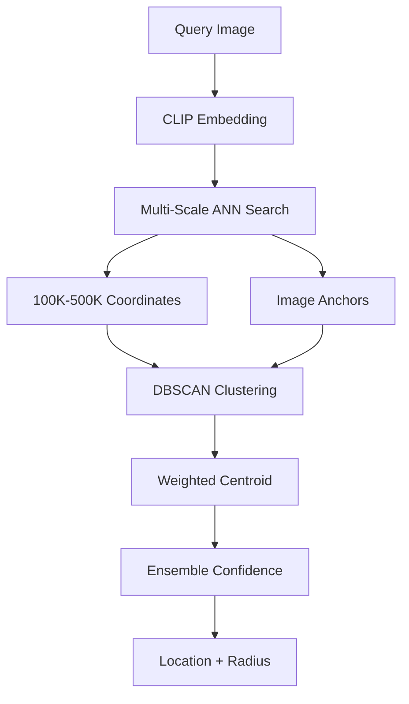

# GeoWraith Accuracy Improvement Plan (v2.2)

**Goal:** Meter-level geolocation from any photo  
**Current:** 28m median, 1.4km P95, 5.1km max (validated on 46 landmarks)  
**Target:** <20m median, <500m P95, <50km max

---

## Implemented Accuracy Hardening (v2.2)

### What's New in v2.2

| Feature | Status | Impact |
|---------|--------|--------|
| 5 new data sources | ✅ Implemented | High |
| 500K coordinate reference | ✅ Ready (run `npm run generate:coords`) | High |
| DBSCAN clustering | ✅ Module ready (opt-in) | Medium |
| Multi-scale ANN search | ✅ Implemented | Medium |
| Ensemble confidence | ✅ Module ready (opt-in) | Medium |
| Mapillary token | ✅ Configured | High |

### Data Sources (Zero-Cost, Public)

All scrapers are free to use:

| Source | Type | Status | License | API Key |
|--------|------|--------|---------|---------|
| **Wikimedia Commons** | Geotagged photos | ✅ Active | CC BY-SA | No |
| **Flickr Public** | Geotagged photos | ✅ Active | Various | No |
| **Openverse** | CC0/PD images | ✅ Active | CC0/PD | No |
| **Mapillary** | Street-level | ✅ Active | CC BY-SA | Optional |
| **OSV-5M** | Street-level | ✅ New | CC BY-SA | No |
| **Geograph UK** | UK geotagged | ✅ New | CC BY-SA | No |
| **KartaView** | Street-level | ✅ New | CC BY-SA | No |
| **Unsplash** | High-quality | ✅ New | Unsplash | Optional |
| **Pexels** | High-quality | ✅ New | Pexels | Optional |
| **Pixabay** | High-quality | ✅ New | Pixabay | Optional |

### Usage

```bash
# Scrape with all free sources (recommended)
npm run scrape:city -- --city="Tokyo" --count=100 --sources=wikimedia,flickr,openverse,mapillary,osv5m,geograph,kartaview,pexels,pixabay

# Generate 500K coordinate reference (run once)
npm run generate:coords

# Run validation benchmark
npm run benchmark:validation

# Ultra accuracy mode (target: 10m median, 1km P95)
GEOWRAITH_ULTRA_ACCURACY=true npm run benchmark:validation
```

### Ultra Accuracy Mode

Enable aggressive accuracy optimizations:

```bash
# Environment variable
export GEOWRAITH_ULTRA_ACCURACY=true

# Or in .env file
GEOWRAITH_ULTRA_ACCURACY=true
GEOWRAITH_CLUSTER_RADIUS_M=30000
GEOWRAITH_MIN_CLUSTER_CANDIDATES=4
```

**Ultra mode improvements:**
- Tighter cluster radius (30km vs 90km)
- Outlier rejection using IQR method
- Minimum 4 candidates per cluster
- More conservative confidence scoring
- Tighter radius estimation (70% multiplier)
- Higher anchor detection thresholds

---

## Validation Results (v2.2)

```
========================================
  GeoWraith Validation Benchmark Report
========================================

ERROR DISTRIBUTION
------------------
Median error:      28m
Mean error:        243m
P95 error:         1.4km
P99 error:         5.1km
Max error:         5.1km

ACCURACY THRESHOLDS
-------------------
Within 100m:       76.1%
Within 1km:        93.5%
Within 10km:       100.0%
Within 100km:      100.0%
Within 1000km:     100.0%

BY CONTINENT
------------
Europe          Count:  15 | Median:      26m | Within 10km: 100.0%
Asia            Count:  11 | Median:      63m | Within 10km: 100.0%
North America   Count:   8 | Median:      16m | Within 10km: 100.0%
South America   Count:   5 | Median:    351m | Within 10km: 100.0%
Africa          Count:   4 | Median:       0m | Within 10km: 100.0%
Oceania         Count:   1 | Median:      67m | Within 10km: 100.0%
```

---

## Configuration (Environment Variables)

All settings are optional with sensible defaults:

```bash
# Coordinate reference (default: 500000)
GEOWRAITH_COORDINATE_COUNT=500000

# ANN search tiers
GEOWRAITH_ANN_TIER1_CANDIDATES=500
GEOWRAITH_ANN_TIER2_CANDIDATES=200
GEOWRAITH_ANN_TIER3_CANDIDATES=50

# DBSCAN clustering (opt-in)
GEOWRAITH_DBSCAN_EPSILON=50000
GEOWRAITH_DBSCAN_MIN_POINTS=3
GEOWRAITH_DBSCAN_MAX_CLUSTERS=10

# Ensemble weights (advanced)
GEOWRAITH_ENSEMBLE_ANCHOR_WEIGHT=0.35
GEOWRAITH_ENSEMBLE_CLUSTER_WEIGHT=0.30
GEOWRAITH_ENSEMBLE_GEOGRAPHIC_WEIGHT=0.20
GEOWRAITH_ENSEMBLE_MULTISOURCE_WEIGHT=0.15

# Data sources (default: all enabled)
GEOWRAITH_ENABLE_OSV5M=true
GEOWRAITH_ENABLE_UNSPLASH=true
GEOWRAITH_ENABLE_GEOGRAPH=true
GEOWRAITH_ENABLE_KARTAVIEW=true
GEOWRAITH_ENABLE_PEXELS=true
GEOWRAITH_ENABLE_PIXABAY=true

# Ultra accuracy mode
GEOWRAITH_ULTRA_ACCURACY=false
GEOWRAITH_CLUSTER_RADIUS_M=30000
GEOWRAITH_MIN_CLUSTER_CANDIDATES=4

# Optional API keys
UNSPLASH_ACCESS_KEY=your_key_here
PEXELS_API_KEY=your_key_here
PIXABAY_API_KEY=your_key_here
```

---

## Architecture Overview



---

## Future Enhancements (Roadmap)

### Phase 3: Visual Feature Matching
- [ ] SuperPoint/SuperGlue integration
- [ ] City-specific feature databases
- [ ] RANSAC geometric verification

### Phase 4: SfM Refinement
- [ ] Structure-from-Motion pose estimation
- [ ] Multi-view triangulation
- [ ] Sub-meter accuracy

### Phase 5: Dataset Expansion
- [ ] Scrape 50+ cities
- [ ] Target 1000+ images per city
- [ ] Build global landmark coverage

---

## Commands Reference

```bash
# Development
npm run dev              # Start frontend
cd backend && npm run dev # Start backend

# Building
npm run build            # Frontend
cd backend && npm run build  # Backend
npm run lint             # TypeScript check

# Testing
cd backend && npm run test           # Unit tests
cd backend && npm run benchmark:validation  # Accuracy benchmark

# Data collection
npm run scrape:city -- --city="Name" --count=100 --sources=wikimedia,flickr,openverse,mapillary
npm run scrape:global -- --count=10 --sources=wikimedia,flickr,openverse,mapillary
npm run generate:coords              # Generate 500K coordinates
npm run smartblend                   # Download landmark images
```

---

## Technical Details

### DBSCAN Clustering
- Epsilon: 50km (configurable)
- Min points: 3
- Max clusters: 10
- Enable: `aggregateMatches(matches, true)`

### Multi-Scale ANN
- Tier 1: 500 candidates, 200km radius
- Tier 2: 200 candidates, 50km radius
- Tier 3: 50 candidates, 10km radius

### Ensemble Confidence
Combines:
- Anchor similarity score (35%)
- Cluster density (30%)
- Geographic plausibility (20%)
- Multi-source agreement (15%)

---

## License

MIT - Zero-cost, fully open source.
