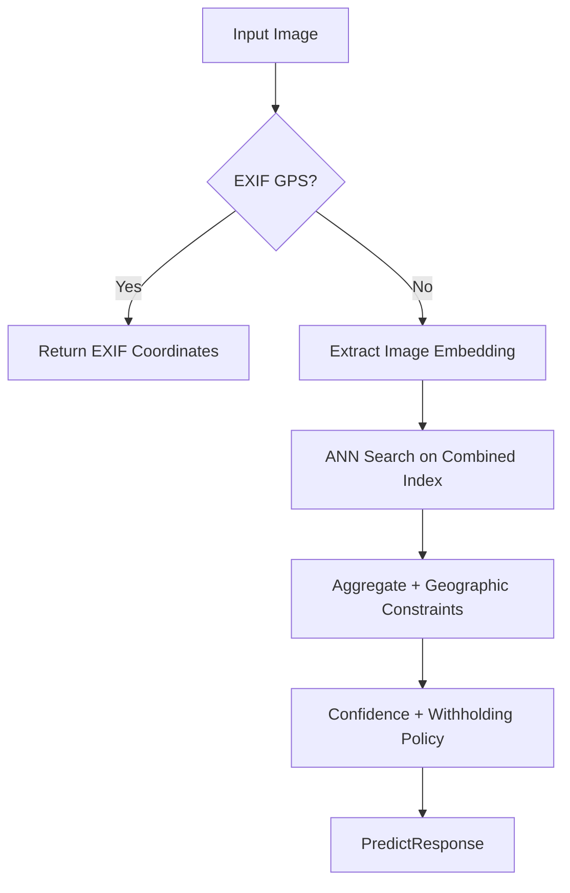

# GeoWraith Architecture

**Version:** 2.2  
**Last Updated:** 2026-02-27  
**Status:** Core pipeline stable; SfM endpoint feature-gated by default.

> **Quick Links:** [README](README.md) | [Status](STATUS.md) | [Reproducibility Playbook](docs/REPRODUCIBILITY_PLAYBOOK.md) | [Validation Guide](VALIDATION_GUIDE.md)

---

## 1. System Overview

GeoWraith predicts image location using a local-first inference and retrieval pipeline.

---

## 2. Inference Modes

GeoWraith uses a fallback chain:

1. **GeoCLIP ONNX** (`backend/src/services/clipExtractor.ts`)
- `vision_model_q4.onnx`
- `location_model_uint8.onnx`

2. **CLIP text-matching fallback** (`backend/src/services/clipGeolocator.ts`)
- `Xenova/clip-vit-base-patch32`
- City text embedding index (`WORLD_CITIES`)

3. **Deterministic fallback** (`backend/src/services/imageSignals.ts`)
- Hand-crafted image features when model extraction fails

---

## 3. Reference Index Composition

The active search index is built in `backend/src/services/geoclipIndex.ts` and combines:

- Coordinate embeddings from `backend/src/data/geoclipCoordinates.json`
- Multi-source image anchors from `backend/.cache/geoclip/referenceImageVectors.merged_v1.json`

In the current validated workspace:

- Coordinates: 54,646
- Image anchors: 1,081
- Total combined vectors: 55,727

Index is cached to HNSW binary files in `backend/.cache/geoclip/`.

---

## 4. Retrieval and Aggregation

Key modules:

- `backend/src/services/vectorSearch.ts`
- `backend/src/services/geoConstraints.ts`
- `backend/src/services/predictPipeline.ts`

Behavioral controls:

- continent consistency filtering
- rank-aware voting
- cohort-aware confidence thresholds and location withholding
  (`MINIMUM_CONFIDENCE` + top-match coherence checks)

---

## 5. Scene Context and Cohort Hints

Live prediction responses can include scene context generated by:

- `backend/src/services/sceneClassifier.ts`

Validation benchmark cohorts are computed by:

- `backend/src/benchmarks/validationBenchmark/geo.ts`
- `backend/src/benchmarks/validationBenchmark/runner.ts`

Cohorts:

- `iconic_landmark`
- `generic_scene`

---

## 6. API Surface

Primary endpoint:

- `POST /api/predict`

Additional endpoint (feature-gated):

- `POST /api/predict/sfm`

Health:

- `GET /health`

Contract reference:

- `backend/docs/openapi.yaml`

---

## 7. Configuration

Runtime configuration is defined in:

- `backend/src/config.ts`

Important controls:

- `GEOWRAITH_OFFLINE`
- `GEOWRAITH_ENABLE_SFM`
- `GEOWRAITH_COORDINATE_COUNT`
- confidence thresholds (`CONFIDENCE_THRESHOLDS`,
  `MINIMUM_CONFIDENCE` plus top-match coherence checks)

---

## 8. Validation Architecture

Validation benchmark implementation:

- `backend/src/benchmarks/validationBenchmark/`

Outputs:

- `backend/.cache/validation_gallery/benchmark_report.json`

Metrics include:

- aggregate distance thresholds
- by-continent split
- by-scene-type split
- by-cohort split (`iconic_landmark` vs `generic_scene`)

---

## 9. Reproduction and Drift Control

Use these docs together:

- [docs/REPRODUCIBILITY_PLAYBOOK.md](docs/REPRODUCIBILITY_PLAYBOOK.md)
- [VALIDATION_GUIDE.md](VALIDATION_GUIDE.md)
- [STATUS.md](STATUS.md)

Do not mix benchmark claims from different model modes or dataset snapshots.
