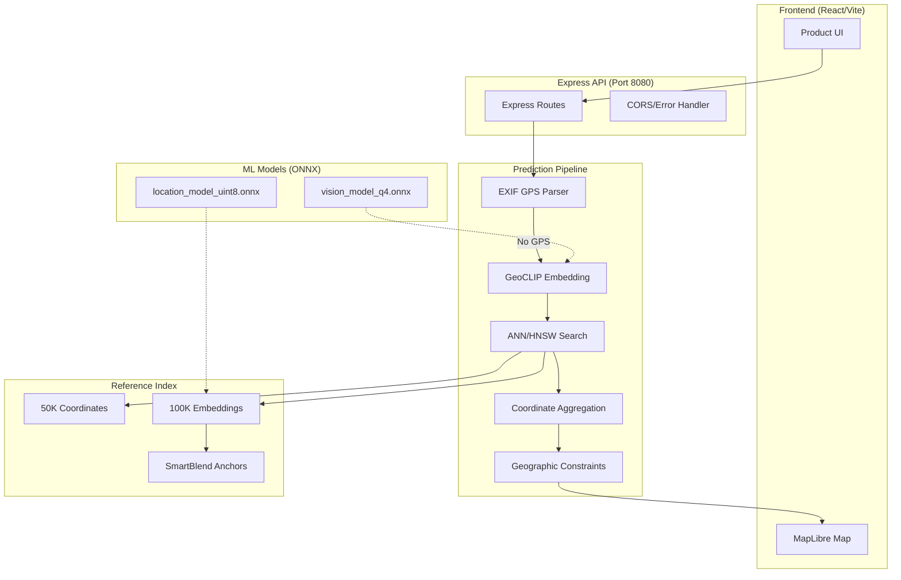
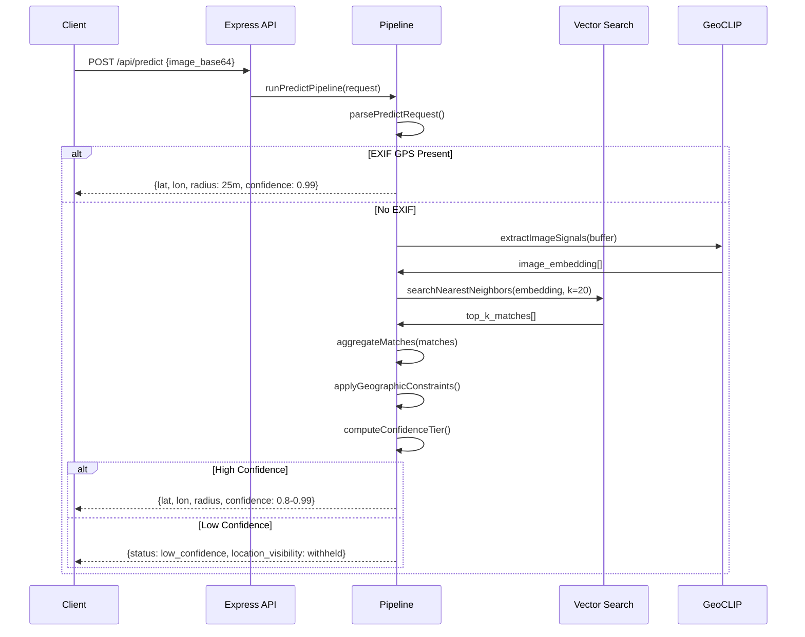
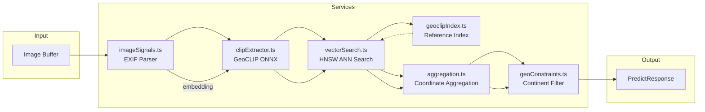
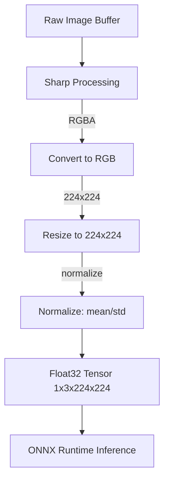
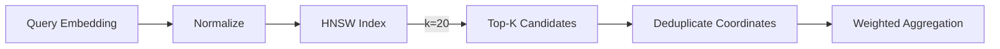
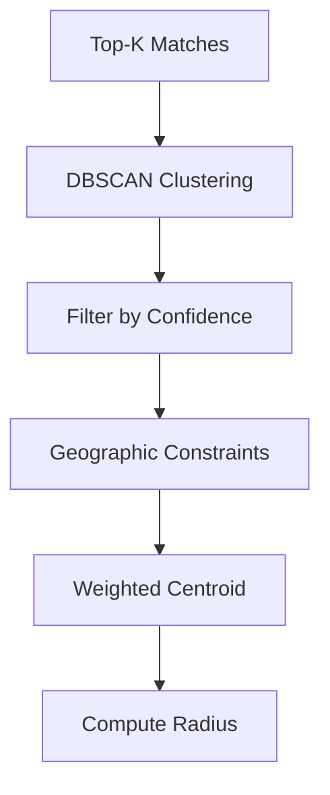
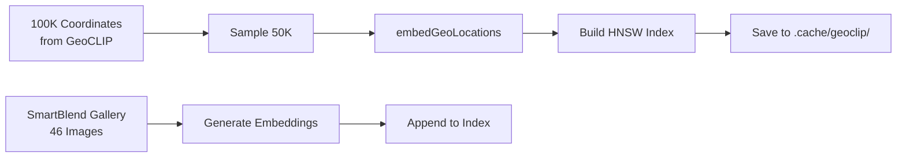
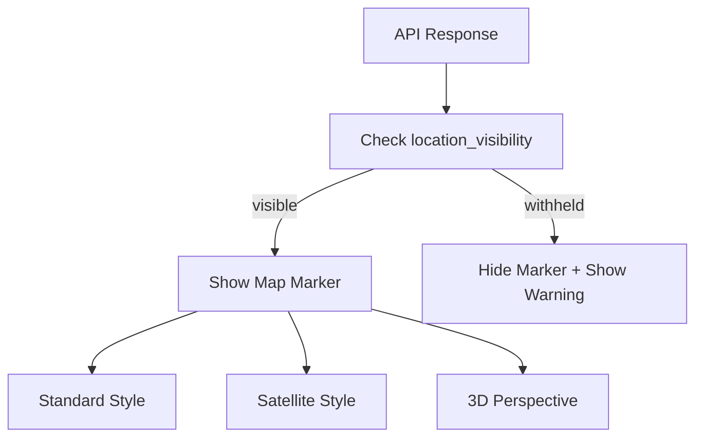

# GeoWraith Architecture

**Version:** 2.2  
**Last Updated:** 2026-02-27  
**Status:** Production (Core), Deferred (SfM)

---

## System Overview

GeoWraith is a local-first visual geolocation system that infers geographic coordinates from static images. It combines EXIF GPS passthrough, GeoCLIP visual embeddings, approximate nearest neighbor (ANN) search, and coordinate aggregation to produce location predictions.



---

## Component Flow

### 1. Request Flow



### 2. Backend Services



---

## API Endpoints

### Core Endpoints

| Method | Path | Description |
|--------|------|-------------|
| GET | `/health` | Service health check |
| GET | `/` | Service info & endpoints |
| POST | `/api/predict` | Main geolocation endpoint |
| POST | `/api/predict/sfm` | SfM refinement (disabled by default) |

### `/api/predict` Request

```typescript
interface PredictRequest {
  image_base64?: string;  // Base64-encoded image
  image_url?: string;     // Not supported (blocked for offline)
  options?: {
    mode?: 'fast' | 'accurate';  // k=8 or k=20 neighbors
  };
}
```

### `/api/predict` Response

```typescript
interface PredictResponse {
  request_id: string;
  status: 'ok' | 'low_confidence';
  mode: 'fast' | 'accurate';
  location: {
    lat: number;
    lon: number;
    radius_m: number;
  };
  location_visibility?: 'visible' | 'withheld';
  location_reason?: string;
  confidence: number;
  confidence_tier?: 'high' | 'medium' | 'low';
  elapsed_ms: number;
  notes?: string;
  top_matches: Array<{
    id: string;
    label: string;
    lat: number;
    lon: number;
    similarity: number;
  }>;
  diagnostics: {
    embedding_source: 'geoclip' | 'fallback';
    reference_index_source: 'model' | 'cache' | 'fallback' | 'unknown';
    reference_image_anchors?: number;
  };
}
```

### `/health` Response

```typescript
interface HealthResponse {
  status: 'ok';
  service: 'geowraith-backend';
  version: '0.2.0';
  offline_mode: boolean;
  sfm_enabled: boolean;
  engine: 'local-visual-signal-v1';
}
```

---

## Required Models

GeoWraith uses GeoCLIP ONNX models for visual embedding extraction.

### Model Files

| File | Size | Source | Purpose |
|------|------|--------|---------|
| `vision_model_q4.onnx` | ~189MB | Xenova/geoclip-large-patch14 | Image embedding (ViT) |
| `location_model_uint8.onnx` | ~9.1MB | Xenova/geoclip-large-patch14 | Coordinate embedding |

### Download Commands

```bash
# Create cache directory
mkdir -p backend/.cache/geoclip

# Download from HuggingFace (requires HuggingFace CLI)
huggingface-cli download Xenova/geoclip-large-patch14 \
  --include "vision_model_q4.onnx" \
  --local-dir backend/.cache/geoclip

huggingface-cli download Xenova/geoclip-large-patch14 \
  --include "location_model_uint8.onnx" \
  --local-dir backend/.cache/geoclip
```

### Model Loading

Models are loaded on first use and cached in memory:

```typescript
// backend/src/services/clipExtractor.ts
const VISION_MODEL = path.join(MODEL_DIR, 'vision_model_q4.onnx');
const LOCATION_MODEL = path.join(MODEL_DIR, 'location_model_uint8.onnx');

async function getGeoCLIPSessions() {
  if (!visionSession || !locationSession) {
    [visionSession, locationSession] = await Promise.all([
      ort.InferenceSession.create(VISION_MODEL),
      ort.InferenceSession.create(LOCATION_MODEL),
    ]);
  }
}
```

---

## Data Pipeline

### 1. Image Preprocessing



### 2. Vector Search (HNSW)



### 3. Coordinate Aggregation



---

## Configuration

### Environment Variables

Create `backend/.env` from the example:

```bash
# Backend Configuration
GEOWRAITH_API_PORT=8080
GEOWRAITH_OFFLINE=false
GEOWRAITH_MAX_IMAGE_BYTES=10485760
GEOWRAITH_ENABLE_SFM=false

# Optional: Mapillary for SfM refinement
# MAPILLARY_ACCESS_TOKEN=MLY|...
```

### Key Configuration Values

```typescript
// backend/src/config.ts
export const config = {
  apiPort: parseInt(process.env.GEOWRAITH_API_PORT ?? '8080', 10),
  offlineMode: process.env.GEOWRAITH_OFFLINE === 'true',
  maxImageBytes: parseInt(process.env.GEOWRAITH_MAX_IMAGE_BYTES ?? '10485760', 10),
  sfmEnabled: process.env.GEOWRAITH_ENABLE_SFM === 'true',
};

// Confidence thresholds
export const CONFIDENCE_THRESHOLDS = {
  high: { min: 0.75 },
  medium: { min: 0.60 },
};

export const MINIMUM_CONFIDENCE = 0.60;
```

---

## Index Generation

### Reference Dataset



### Build Commands

```bash
cd backend

# Generate 100K coordinates (if missing)
npm run generate:coords

# Build reference dataset
npm run build:dataset

# Build validation gallery
npm run build:gallery

# Run validation benchmark
npm run benchmark:validation
```

---

## Frontend Integration

### API Client

```typescript
// src/lib/api.ts
const API_BASE = import.meta.env.VITE_API_BASE ?? 'http://localhost:8080';

export async function predictImage(
  payload: PredictRequest,
  signal?: AbortSignal
): Promise<PredictResponse> {
  const res = await fetch(`${API_BASE}/api/predict`, {
    method: 'POST',
    headers: { 'Content-Type': 'application/json' },
    body: JSON.stringify(payload),
    signal,
  });
  
  if (!res.ok) {
    throw new Error(`Request failed with status ${res.status}`);
  }
  
  return res.json();
}
```

### Map Display



---

## Offline Mode

GeoWraith supports fully offline operation:

```mermaid
flowchart LR
    ONLINE[Online Mode] -->|GEOWRAITH_OFFLINE=true| OFFLINE[Offline Mode]
    
    OFFLINE --> CACHE[Tile Cache (IndexedDB)]
    CACHE -->|cached://| MAP[MapLibre cached:// protocol]
    
    OFFLINE --> MODEL[Local ONNX Models]
    OFFLINE --> INDEX[Local HNSW Index]
```

### Offline Features
- Tile caching via IndexedDB (100MB desktop, 30MB mobile)
- Local GeoCLIP inference (no network required)
- LRU eviction policy for old tiles

---

## Testing

### Test Commands

```bash
# Frontend
npm run lint          # TypeScript check
npm run build         # Production build

# Backend
cd backend
npm run lint          # TypeScript check
npm run test         # Run all tests
npm run test -- src/routes/predict.test.ts  # Single file
npm run test -- --grep "health"             # Pattern match

# Benchmarks
npm run benchmark:accuracy      # Synthetic accuracy
npm run benchmark:search       # HNSW performance
npm run benchmark:validation   # Real-world accuracy
```

### Test Structure

```typescript
// backend/src/app.test.ts
describe('GeoWraith API', () => {
  it('GET /health returns ok', async () => {
    const res = await request(app).get('/health');
    expect(res.status).toBe(200);
    expect(res.body.status).toBe('ok');
  });
  
  it('POST /api/predict processes image', async () => {
    const res = await request(app)
      .post('/api/predict')
      .send({ image_base64: '...' });
    expect(res.status).toBe(200);
    expect(res.body.location).toBeDefined();
  });
});
```

---

## Project Structure

```
geowraith/
├── src/                          # React Frontend
│   ├── components/
│   │   ├── product/              # Product UI components
│   │   │   ├── MapView.tsx      # MapLibre map
│   │   │   ├── ResultsPanel.tsx  # Prediction results
│   │   │   ├── ProductUI.tsx     # Main product interface
│   │   │   └── mapStyles.ts     # Map tile styles
│   │   └── sections/             # Landing page sections
│   ├── lib/
│   │   ├── api.ts               # API client
│   │   ├── demo.ts              # Demo mode dispatcher
│   │   ├── tileCache.ts         # IndexedDB tile cache
│   │   └── offlineProtocol.ts    # cached:// protocol
│   └── hooks/                    # React hooks
│
├── backend/                      # Node/Express API
│   ├── src/
│   │   ├── app.ts               # Express routes
│   │   ├── index.ts             # Server entry
│   │   ├── config.ts            # Configuration
│   │   ├── services/
│   │   │   ├── predictPipeline.ts    # Main pipeline
│   │   │   ├── clipExtractor.ts       # GeoCLIP ONNX
│   │   │   ├── vectorSearch.ts       # ANN search
│   │   │   ├── geoclipIndex.ts      # Reference index
│   │   │   ├── aggregation.ts       # Coordinate aggregation
│   │   │   ├── geoConstraints.ts    # Geographic filtering
│   │   │   ├── annIndex.ts          # HNSW implementation
│   │   │   └── imageSignals.ts      # EXIF parsing
│   │   ├── sfm/                 # SfM pipeline (deferred)
│   │   ├── scripts/             # Data building scripts
│   │   ├── benchmarks/           # Accuracy benchmarks
│   │   └── data/                # Static data
│   ├── docs/                    # OpenAPI spec
│   └── .cache/                  # Model/embedding cache
│       └── geoclip/
│           ├── vision_model_q4.onnx
│           ├── location_model_uint8.onnx
│           ├── coordinates_100K.json
│           ├── reference_vectors.json
│           └── hnsw_index.bin
│
└── package.json
```

---

## Dependencies

### Frontend (package.json)

```json
{
  "dependencies": {
    "react": "^19.0.0",
    "react-dom": "^19.0.0",
    "maplibre-gl": "^5.19.0",
    "lucide-react": "^0.546.0",
    "motion": "^12.23.24"
  },
  "devDependencies": {
    "@vitejs/plugin-react": "^5.0.4",
    "typescript": "~5.8.2",
    "vite": "^6.2.0"
  }
}
```

### Backend (backend/package.json)

```json
{
  "dependencies": {
    "@xenova/transformers": "^2.17.2",
    "express": "^4.21.2",
    "onnxruntime-node": "^1.22.0",
    "sharp": "^0.34.4",
    "hnswlib-node": "^3.0.0",
    "exifr": "^7.1.3",
    "axios": "^1.13.5"
  },
  "devDependencies": {
    "typescript": "~5.8.2",
    "tsx": "^4.21.0",
    "nodemon": "^3.1.14"
  }
}
```

---

## Running the System

### Quick Start

```bash
# Install dependencies
npm install
cd backend && npm install && cd ..

# Start both services
./start.sh

# Or manually:
# Terminal 1: Backend
cd backend && npm run dev

# Terminal 2: Frontend
npm run dev
```

### Access Points

- **Frontend:** http://localhost:3001
- **Backend API:** http://localhost:8080
- **Health:** http://localhost:8080/health

---

## Accuracy Targets

| Metric | Target | Current (Validation) |
|--------|--------|---------------------|
| Median Error | <10km | ~34m (SmartBlend) |
| P95 Error | <1km | ~1.6km |
| Confidence Threshold | 60% | 60% |
| Coverage | Global | 6 continents |

**Note:** Real-world accuracy varies by image quality and landmark visibility. Low-confidence results are withheld to prevent false predictions.

---

## Related Documentation

| Document | Description |
|----------|-------------|
| [README.md](../README.md) | Main project documentation |
| [AGENTS.md](../AGENTS.md) | Build/lint/test commands and code style for agents |
| [STATUS.md](../STATUS.md) | Current project status and component matrix |
| [knowissues.md](../knowissues.md) | Known issues, gaps, and risks |
| [Memory.md](../Memory.md) | Durable high-level memory of decisions |
| [.agent/CONTINUITY.md](../.agent/CONTINUITY.md) | Task-by-task operational continuity |
| [docs/DEPLOYMENT_RUNBOOK.md](docs/DEPLOYMENT_RUNBOOK.md) | Production deployment guide |
| [docs/SFM_PIPELINE_ARCHITECTURE.md](docs/SFM_PIPELINE_ARCHITECTURE.md) | SfM refinement pipeline design |
| [VALIDATION_GUIDE.md](VALIDATION_GUIDE.md) | Real-world accuracy validation workflow |
| [SMARTBLEND_GUIDE.md](SMARTBLEND_GUIDE.md) | SmartBlend landmark database guide |
