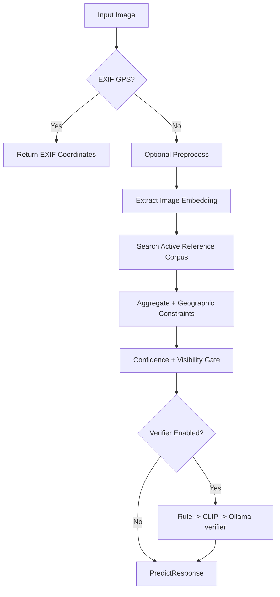

# GeoWraith Architecture

**Version:** 2.2  
**Last Updated:** 2026-03-02  
**Status:** Hybrid local-first pipeline active; remaining generic-scene misses under investigation.

> **Quick Links:** [README](README.md) | [Status](STATUS.md) | [Reproducibility Playbook](docs/REPRODUCIBILITY_PLAYBOOK.md) | [Validation Guide](VALIDATION_GUIDE.md)

---

## 1. System Overview

GeoWraith predicts image location using a local-first inference and retrieval pipeline.

```mermaid
flowchart TB
    A[Input Image] --> B{EXIF GPS?}
    B -->|Yes| C[Return EXIF Coordinates]
    B -->|No| D[Optional Preprocess]
    D --> E[Extract Image Embedding]
    E --> F[Search Active Reference Corpus]
    F --> G[Aggregate + Geographic Constraints]
    G --> H[Confidence + Visibility Gate]
    H --> I{Verifier Enabled?}
    I -->|No| J[PredictResponse]
    I -->|Yes| K[Rule -> CLIP -> Ollama verifier]
    K --> J
```

---

## 2. Embedding and Fallback Modes

GeoWraith uses a tiered embedding strategy:

1. **GeoCLIP ONNX** (`backend/src/services/clipExtractor.ts`)
   - preferred path for validated benchmark parity
2. **CLIP fallback** (`backend/src/services/imageSignals.ts`)
   - used for explicit comparison or when GeoCLIP is unavailable
3. **Deterministic fallback** (`backend/src/services/imageSignals.ts`)
   - last-resort recovery path

The backend now exposes runtime switches for controlled experiments:

- `GEOWRAITH_IMAGE_EMBEDDING_BACKEND=auto|geoclip|clip|fallback`
- `GEOWRAITH_REFERENCE_BACKEND=auto|geoclip|clip|fallback`

These switches are intended for benchmark comparison and failure analysis, not for headline claims.

---

## 3. Image Preprocessing

The inference pipeline can normalize the image before embedding:

- `none`
- `jpeg-only`
- `contain-224-jpeg`
- `cover-224-jpeg` (current default)

Implemented in:

- `backend/src/services/imageProcessor.ts`
- `backend/src/services/predictPipeline.ts`

The preprocessing ablation on 2026-03-02 showed that these simple swaps do not fix Marrakech or
Copacabana, although `cover-224-jpeg` remains the least-bad option among the tested modes.

---

## 4. Reference Index Composition

The active search index is built in `backend/src/services/geoclipIndex.ts`.

Primary validated corpus:

- Unified GeoCLIP reference corpus
  - base references
  - Mapillary densification
  - synthetic geo-anchors

Current validated unified snapshot:

- unified reference vectors: `1,468`
- validation benchmark: `56/58` within `10km`

Search behavior is implemented in:

- `backend/src/services/vectorSearch.ts`

Notable current behavior:

- boosted legacy anchors and non-legacy ANN candidates are mixed intentionally
- coherent supplemental cluster promotion operates in the same boosted score space as final ranking
- image-anchor injection is disabled when the reference backend is forced to `clip` or `fallback`,
  avoiding mixed embedding spaces

---

## 5. Aggregation, Confidence, and Visibility

Core modules:

- `backend/src/services/vectorSearch.ts`
- `backend/src/services/confidenceCalibration.ts`
- `backend/src/services/confidenceGate.ts`
- `backend/src/services/predictPipeline.ts`

Behavioral controls:

- continent-aware filtering
- rank-aware consensus and aggregation
- confidence calibration based on match shape and anchor provenance
- coordinate withholding for weak or incoherent results

This is why exact curated wins can now surface as `high` confidence without promoting the remaining
generic-scene confusers.

---

## 6. Optional Verifier and Intelligence Layers

Optional runtime features:

- verifier: `backend/src/services/verifier.ts`
- Ollama client: `backend/src/services/ollamaClient.ts`
- intelligence briefs: `backend/src/services/intelligenceBrief.ts`
- anomaly detection: `backend/src/services/anomalyDetector.ts`

Current local default verifier model:

- `qwen3.5:9b`

The last verified verifier-enabled rerun did not improve the `56/58` validation result, so the
verifier should still be treated as experimental.

---

## 7. Frontend Surface Split

The frontend is intentionally split into two page-level surfaces:

- `/`:
  marketing narrative and capability preview
- `/demo`:
  Mission Console for replay scenarios, live inference, map layers, anomaly/intelligence cards,
  report export, and service readiness

Key frontend files:

- `src/pages/LandingPage.tsx`
- `src/pages/DemoPage.tsx`
- `src/components/demo/*`

---

## 8. Validation and Investigation Tooling

Validation benchmark implementation:

- `backend/src/benchmarks/validationBenchmark/`

Investigation helpers:

- `npm run benchmark:validation`
- `npm run benchmark:holdout`
- `npm run investigate:failures`
- `npm run ablate:preprocess`
- `npm run benchmark:compare-models -- --benchmark=validation`

Generated artifacts:

- `backend/.cache/validation_gallery/benchmark_report.json`
- `backend/.cache/holdout_gallery/benchmark_report.json`
- `backend/.cache/geoclip/hard_failure_investigation.json`
- `backend/.cache/geoclip/preprocessing_ablation.json`
- `backend/.cache/geoclip/model_profile_comparison.validation.json`

---

## 9. Reproduction and Drift Control

Use these docs together:

- [docs/REPRODUCIBILITY_PLAYBOOK.md](docs/REPRODUCIBILITY_PLAYBOOK.md)
- [VALIDATION_GUIDE.md](VALIDATION_GUIDE.md)
- [STATUS.md](STATUS.md)

Rules:

- do not mix benchmark sets in one headline claim
- do not claim holdout parity from the current 11-image seed alone
- do not inject benchmark images into the active retrieval corpus
- always report model mode, corpus mode, and benchmark size together
