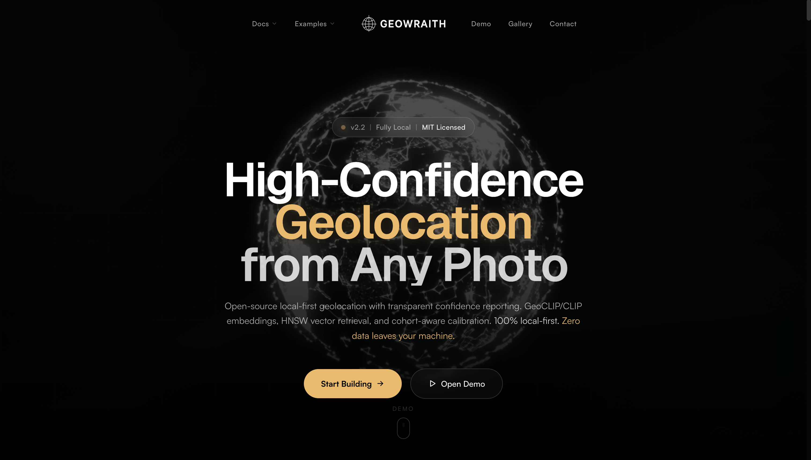
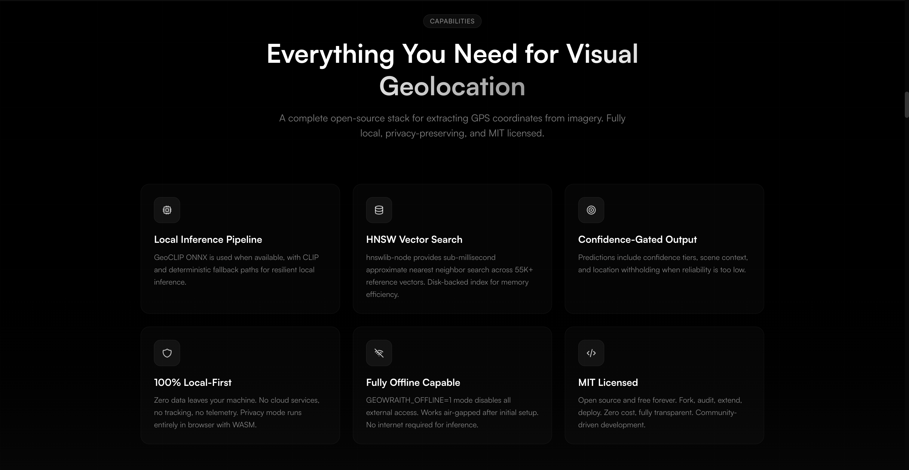
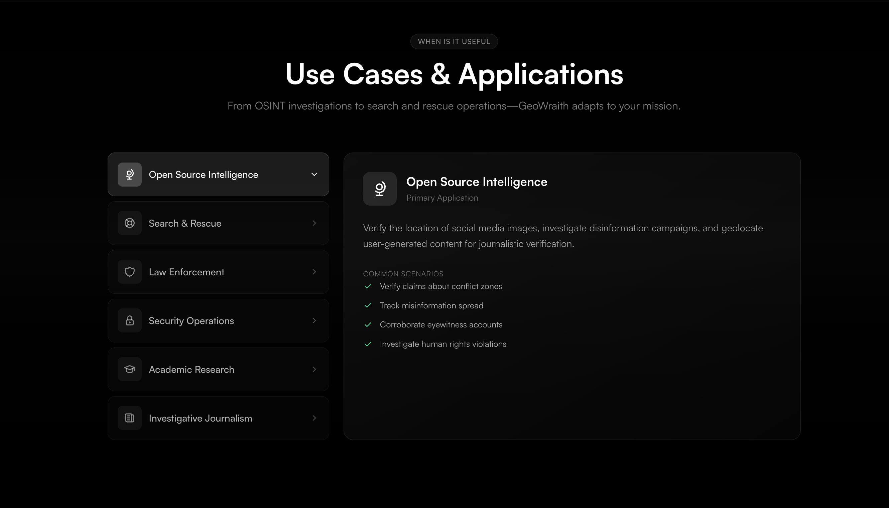
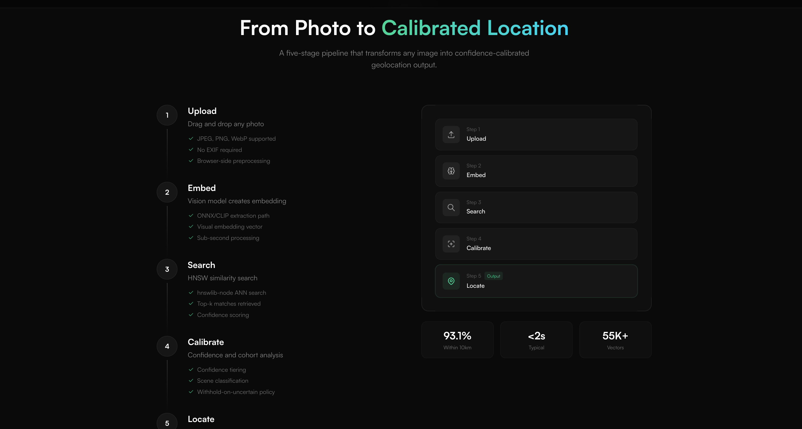
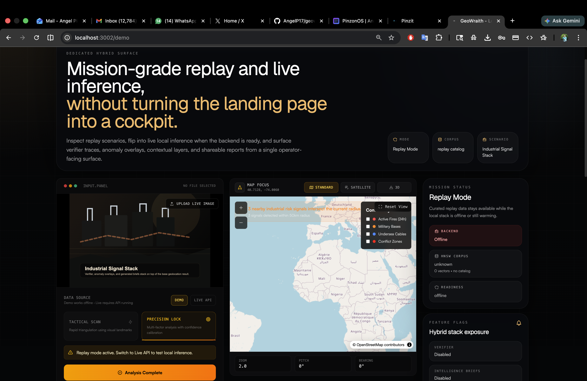

# GeoWraith v2.2

Local-first visual geolocation with explicit confidence gating and reproducible validation.

> **Quick Links:** [Status](STATUS.md) | [Architecture](ARCHITECTURE.md) | [Validation Guide](VALIDATION_GUIDE.md) | [Reproducibility Playbook](docs/REPRODUCIBILITY_PLAYBOOK.md) | [Known Issues](knowissues.md)

---

## Screenshots

### Landing Page

**Hero Section**


**Features**


**How It Works**


**Demo Preview**


### Mission Console

**Demo Page**


---

## What GeoWraith Is

GeoWraith is an experimental geolocation system that predicts coordinates from images using a local pipeline:

- EXIF passthrough when image GPS metadata exists
- GeoCLIP ONNX embeddings (preferred)
- CLIP text-matching fallback if ONNX files are unavailable
- Deterministic fallback if model paths fail
- ANN/HNSW retrieval over coordinate vectors plus image anchors
- Confidence and match-consensus gating with location withholding for uncertain results

Inference is local-first and does not require paid APIs.

---

## Current Verified Snapshot (2026-03-02)

From `backend/.cache/validation_gallery/benchmark_report.json`:

- Validation set: **58 images**
- Within 10km: **96.6%** (56/58)
- Tail error after the latest unified exact-search ranking fix:
  - mean: **148km**
  - p95: **7.8km**
  - p99/max: **6059km**
- Cohorts:
  - `iconic_landmark`: **100.0%** (22/22)
  - `generic_scene`: **94.4%** (34/36)

Remaining hard failures (generic scenes): Marrakech and Copacabana.

Verifier note: the latest local Ollama path now targets `qwen3.5:9b` by default. A verifier-enabled
rerun on 2026-03-02 did not improve the `56/58` validation result.

Important: these numbers are tied to the current GeoCLIP + anchor corpus in this workspace. Do not generalize without running your own benchmark.

Separate holdout path:

- A distinct seed holdout benchmark now lives under `backend/.cache/holdout_gallery`
- It is built from local images that are checked against the active merged corpus before use
- The current seed set is intentionally small (`17` images) and should be treated as a leakage guard
  plus sanity check, not as a replacement for the 58-image validation benchmark
- A preprocessing ablation across `none`, `jpeg-only`, `contain-224-jpeg`, and `cover-224-jpeg`
  showed that simple preprocessing swaps do not fix Marrakech or Copacabana
- A model-profile comparison confirmed that the current CLIP city-text fallback is far worse than
  GeoCLIP unified on the validation gallery

---

## Models

GeoWraith supports three inference tiers:

1. **GeoCLIP ONNX**
- `backend/.cache/geoclip/vision_model_q4.onnx`
- `backend/.cache/geoclip/location_model_uint8.onnx`

2. **CLIP fallback** (`@xenova/transformers`)
- Auto-downloads `Xenova/clip-vit-base-patch32`
- Used when GeoCLIP ONNX files are missing

3. **Deterministic fallback**
- Last-resort path when model extraction fails

---

## Runtime Notes

- The frontend is intentionally split into two surfaces:
  - `/` keeps the marketing narrative and lightweight capability preview
  - `/demo` hosts the full Mission Console with replay scenarios, live local inference, and runtime status rails
- Product map uses a fixed-height viewport so the basemap does not collapse into a black pane.
- Standard, Satellite, and 3D style switches use a guarded completion path so stalled
  `style.load` events do not leave the map stuck between modes.
- Operator-safe mode keeps the basemap visible while withheld coordinates remain hidden.
- EXIF GPS extraction only runs when the uploaded image actually contains EXIF metadata, so
  valid WebP/GIF uploads no longer spam backend logs with `Unknown file format` warnings.
- Set `GEOWRAITH_DEBUG_BENCHMARK_CANDIDATES=true` when running the backend validation benchmark to
  log raw boosted anchors, supplemental unified candidates, and the final selected match set.
- `GEOWRAITH_IMAGE_PREPROCESS_MODE` controls image normalization before embedding:
  `none`, `jpeg-only`, `contain-224-jpeg`, or `cover-224-jpeg`
- `GEOWRAITH_IMAGE_EMBEDDING_BACKEND` and `GEOWRAITH_REFERENCE_BACKEND` allow targeted benchmarking
  of `geoclip`, `clip`, and deterministic fallback paths without changing benchmark code

---

## Quick Start

```bash
# repo root
npm install

# backend
cd backend
npm install

# run backend
npm run dev

# run frontend (new terminal, repo root)
cd ..
npm run dev
```

Frontend: `http://localhost:3001`  
Mission Console: `http://localhost:3001/demo`  
Backend health: `http://localhost:8080/health`

### Frontend Surfaces

- `/`: marketing landing page, docs, scenarios, and capability preview
- `/demo`: dedicated hybrid console with replay scenarios, live/replay switching, report export,
  map layers, verifier diagnostics, anomaly cards, and service readiness state

### Start Both Services Together

```bash
# repo root
npm run start
```

`start.sh` now defaults to backend `npm run dev` (TypeScript runtime), reuses already-running services on
`3001`/`8080`, and waits through model/index warmup before failing health checks.

Optional overrides:

```bash
BACKEND_START_CMD="npm run dev:watch" npm run start
BACKEND_STARTUP_RETRIES=360 STARTUP_POLL_SECONDS=0.5 npm run start
```

---

## Reproduce Latest Validation Result

```bash
cd backend
GEOWRAITH_USE_UNIFIED_INDEX=true npm run benchmark:validation
```

See full reproducibility instructions in:

- [docs/REPRODUCIBILITY_PLAYBOOK.md](docs/REPRODUCIBILITY_PLAYBOOK.md)

Holdout and failure analysis helpers:

```bash
cd backend
npm run build:gallery:holdout
GEOWRAITH_USE_UNIFIED_INDEX=true npm run benchmark:holdout
GEOWRAITH_USE_UNIFIED_INDEX=true npm run investigate:failures
npm run ablate:preprocess
npm run benchmark:compare-models -- --benchmark=validation
```

Verifier benchmark with the current local default:

```bash
cd backend
GEOWRAITH_USE_UNIFIED_INDEX=true \
GEOWRAITH_ENABLE_VERIFIER=true \
GEOWRAITH_LLM_MODEL=qwen3.5:9b \
npm run benchmark:validation
```

---

## Core Commands

### Frontend (repo root)

```bash
npm run dev
npm run lint
npm run build
```

### Backend (`backend/`)

```bash
npm run dev
npm run lint
npm run test
npm run build
npm run benchmark:validation
npm run build:gallery:holdout
npm run benchmark:holdout
npm run investigate:failures
npm run ablate:preprocess
npm run benchmark:compare-models -- --benchmark=validation
```

---

## Accuracy and Claims Policy

- Always report **model mode** (GeoCLIP ONNX vs CLIP fallback)
- Always report **validation set size**
- Always report **cohort split** (`iconic_landmark` vs `generic_scene`)
- Do not claim meter-level precision from aggregate benchmarks alone

---

## Ethics and Responsible Use

GeoWraith is intended for authorized and lawful use only. Operators are responsible for legal and ethical compliance in their jurisdiction.

---

## License

MIT
