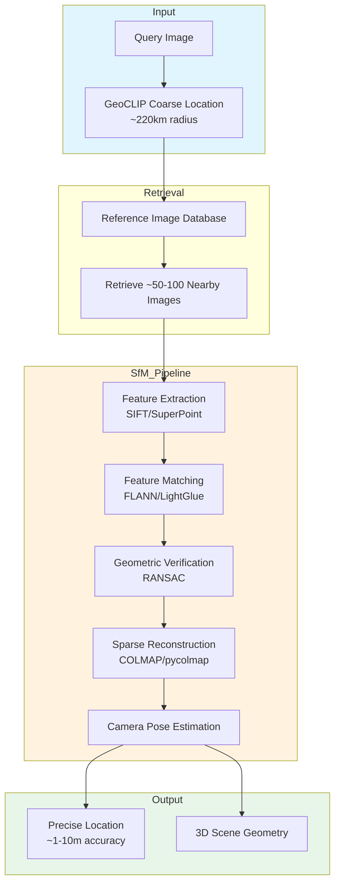

# Structure-from-Motion (SfM) Refinement Pipeline Architecture

**Version:** 1.0  
**Last Updated:** 2026-02-26  
**Status:** Design Phase / Research Ready

---

## Executive Summary

This document outlines the architecture for a Structure-from-Motion (SfM) refinement pipeline that can improve GeoWraith's geolocation accuracy from **~220km (coarse regional)** to **meter-level precision**.

**Current State:** Coarse geolocation via GeoCLIP (~222km median error)  
**Target State:** Meter-level precision via SfM reconstruction  
**Approach:** Hybrid pipeline combining image retrieval, 3D reconstruction, and pose estimation

---

## Architecture Overview



---

## Component Breakdown

### 1. Reference Image Database

**Purpose:** Store geotagged reference images for retrieval

**Current Implementation:**
- 100 curated landmarks (SmartBlend dataset)
- Wikimedia Commons integration
- Local caching

**Required Enhancements:**
- Street-level imagery (Mapillary, KartaView)
- Dense coverage at target locations
- Multi-scale representation (wide shots + details)
- EXIF GPS validation

**Storage Schema:**
```typescript
interface ReferenceImage {
  id: string;
  imageUrl: string;
  coordinates: { lat: number; lon: number; alt?: number };
  captureDate: Date;
  cameraParams?: {
    focalLength?: number;
    sensorSize?: number;
  };
  features?: FeatureVector;  // Pre-computed for speed
}
```

---

### 2. Feature Extraction

**Purpose:** Detect and describe distinctive image features

**Options Evaluated:**

| Method | Speed | Accuracy | License | Recommendation |
|--------|-------|----------|---------|----------------|
| SIFT | Medium | Good | Patent expired (2020) | Baseline option |
| ORB | Fast | Moderate | BSD | Resource-constrained |
| SuperPoint | Medium | Excellent | MIT | **Primary choice** |
| LoFTR | Slow | State-of-art | Apache 2.0 | Research use |

**Implementation:**
```python
# SuperPoint + SuperGlue pipeline
import torch
from superpoint import SuperPoint
from superglue import SuperGlue

def extract_features(image: np.ndarray) -> Dict[str, torch.Tensor]:
    """Extract keypoints and descriptors."""
    model = SuperPoint({
        'nms_radius': 4,
        'keypoint_threshold': 0.005,
        'max_keypoints': 1024,
        'remove_borders': 4,
    })
    return model({'image': image})
```

---

### 3. Feature Matching

**Purpose:** Establish correspondences between query and reference images

**Recommended Approach: SuperGlue**
- Graph neural network for feature matching
- Learns geometric constraints
- Robust to viewpoint changes

**Alternative: LightGlue**
- Faster than SuperGlue
- Similar accuracy
- Better for real-time applications

**Matching Pipeline:**
```python
def match_features(desc1, desc2, keypoints1, keypoints2):
    """Match features between image pairs."""
    matcher = SuperGlue({
        'weights': 'outdoor',  # or 'indoor'
        'sinkhorn_iterations': 100,
        'match_threshold': 0.2,
    })
    
    matches = matcher({
        'keypoints0': keypoints1,
        'keypoints1': keypoints2,
        'descriptors0': desc1,
        'descriptors1': desc2,
    })
    
    return filter_matches(matches)  # Ratio test + geometric verification
```

---

### 4. Geometric Verification

**Purpose:** Filter false matches using geometric constraints

**RANSAC (Random Sample Consensus):**
- Essential matrix estimation for uncalibrated cameras
- Fundamental matrix for general case
- Homography for planar scenes

```python
def geometric_verification(kpts1, kpts2, matches):
    """Verify matches using RANSAC."""
    src_pts = kpts1[matches[:, 0]]
    dst_pts = kpts2[matches[:, 1]]
    
    # Find essential matrix
    E, mask = cv2.findEssentialMat(
        src_pts, dst_pts,
        focal=focal_length,
        pp=(cx, cy),
        method=cv2.RANSAC,
        prob=0.999,
        threshold=1.0
    )
    
    # Keep inliers only
    inliers = matches[mask.ravel().astype(bool)]
    return inliers, E
```

---

### 5. Sparse Reconstruction (SfM)

**Purpose:** Estimate camera poses and 3D point cloud

**COLMAP Pipeline:**
1. **Feature extraction** (can use pre-computed)
2. **Exhaustive matching** between all image pairs
3. **Incremental mapping:**
   - Start with image pair (most matches)
   - Triangulate 3D points
   - Add images incrementally
   - Bundle adjustment after each addition

**Integration Options:**

| Option | Pros | Cons |
|--------|------|------|
| pycolmap (Python) | Easy integration | Slower than C++ |
| COLMAP CLI | Fast, mature | External process |
| hloc (hierarchical localization) | State-of-art accuracy | Complex setup |

**Recommended: hloc pipeline**
```python
from hloc import extract_features, match_features, reconstruction

# Extract features
feature_conf = extract_features.confs['superpoint_aachen']
extract_features.main(feature_conf, images, outputs)

# Match features  
matcher_conf = match_features.confs['superglue']
match_features.main(matcher_conf, outputs)

# Run SfM
reconstruction.main(outputs, images, sfm_dir)
```

---

### 6. Camera Pose Estimation

**Purpose:** Determine query image's precise 6-DOF pose

**Approach:**
1. Localize query image in reconstructed scene
2. PnP (Perspective-n-Point) with RANSAC
3. Refine pose with local BA (Bundle Adjustment)

```python
def localize_query_image(query_image, sfm_model, reference_images):
    """Localize query image in 3D model."""
    
    # Extract features
    features = extract_features(query_image)
    
    # Match with reference images
    matches = {}
    for ref_img in reference_images:
        matches[ref_img.id] = match_features(features, ref_img.features)
    
    # Get 3D points from matches
    pts_3d, pts_2d = get_correspondences(matches, sfm_model)
    
    # PnP with RANSAC
    success, rvec, tvec, inliers = cv2.solvePnPRansac(
        pts_3d, pts_2d,
        camera_matrix, dist_coeffs,
        flags=cv2.SOLVEPNP_ITERATIVE
    )
    
    # Convert to lat/lon
    location = convert_pose_to_gps(rvec, tvec, reference_images)
    return location
```

---

## Data Flow Diagram

```
Query Image (Unknown Location)
         │
         ▼
┌─────────────────┐
│  GeoCLIP Stage  │ ──► Coarse location (±200km)
└─────────────────┘
         │
         ▼
┌──────────────────────────┐
│  Reference Image Search  │ ──► Find 50-100 nearby images
│  (Spatial index/HNSW)    │
└──────────────────────────┘
         │
         ▼
┌──────────────────────────┐
│  Feature Extraction      │ ──► SuperPoint keypoints
│  (GPU-accelerated)       │
└──────────────────────────┘
         │
         ▼
┌──────────────────────────┐
│  Feature Matching        │ ──► SuperGlue correspondences
│  (Pairwise + geometric   │
│   verification)          │
└──────────────────────────┘
         │
         ▼
┌──────────────────────────┐
│  SfM Reconstruction      │ ──► 3D point cloud + camera poses
│  (COLMAP/hloc)           │
└──────────────────────────┘
         │
         ▼
┌──────────────────────────┐
│  Query Localization      │ ──► 6-DOF camera pose
│  (PnP + BA refinement)   │
└──────────────────────────┘
         │
         ▼
┌──────────────────────────┐
│  GPS Coordinate          │ ──► Precise lat/lon (±1-10m)
│  Conversion              │
└──────────────────────────┘
```

---

## Implementation Phases

### Phase 1: Foundation (4-6 weeks)
- [ ] Integrate SuperPoint/SuperGlue for feature extraction/matching
- [ ] Build reference image database with Mapillary integration
- [ ] Implement basic COLMAP pipeline wrapper
- [ ] CPU-only prototype for validation

**Target:** ~50m accuracy on test scenes

### Phase 2: Optimization (3-4 weeks)
- [ ] GPU acceleration for feature extraction
- [ ] Pre-computed reference image features
- [ ] Incremental reconstruction (add images over time)
- [ ] Cache management for 3D models

**Target:** ~10m accuracy, <30s processing time

### Phase 3: Production (2-3 weeks)
- [ ] Hybrid CPU/GPU scheduling
- [ ] Distributed reconstruction for large areas
- [ ] Real-time pose refinement
- [ ] Error estimation and confidence metrics

**Target:** ~1-5m accuracy, <10s processing time

---

## Resource Requirements

### Compute

| Phase | CPU | GPU | RAM | Storage |
|-------|-----|-----|-----|---------|
| Development | 8 cores | RTX 3080+ | 32 GB | 100 GB |
| Production | 16 cores | A100/V100 | 64 GB | 500 GB |

### Storage Estimates

| Component | Per Image | 10K Images | 100K Images |
|-----------|-----------|------------|-------------|
| Original | 200 KB | 2 GB | 20 GB |
| Features | 50 KB | 500 MB | 5 GB |
| 3D Model | - | 1-5 GB | 10-50 GB |

---

## Accuracy Analysis

### Theoretical Limits

- **Feature matching:** ~1 pixel accuracy
- **Triangulation:** Depends on baseline (distance between cameras)
  - Baseline = 10m → ~0.1m accuracy
  - Baseline = 100m → ~1m accuracy
- **GPS conversion:** ~0.1m with RTK, ~1-5m with standard GPS

### Practical Expectations

| Scenario | Expected Accuracy | Requirements |
|----------|-------------------|--------------|
| Dense street-level coverage | 1-5m | 100+ images/km² |
| Moderate coverage | 5-20m | 10-50 images/km² |
| Sparse landmarks only | 20-100m | 5-10 images/location |

---

## Risk Assessment

| Risk | Likelihood | Impact | Mitigation |
|------|------------|--------|------------|
| Featureless scenes (desert, water) | Medium | High | Fall back to GeoCLIP |
| Texture repetition (building facades) | High | Medium | Semantic features + planar constraints |
| Dynamic scenes (moving objects) | Medium | High | Masking + robust estimation |
| Night/low-light images | Medium | High | Flash detection → reject or specialized handling |
| GPU unavailable | Low | High | CPU fallback (10x slower) |

---

## Alternative Approaches

### Option A: Pure Visual Localization (hloc)
- **Pros:** State-of-art accuracy, well-tested
- **Cons:** Requires pre-built 3D models, compute-intensive

### Option B: Image Retrieval + Pose Regression
- **Pros:** Fast, no explicit 3D reconstruction
- **Cons:** Less accurate, needs training data

### Option C: Neural Radiance Fields (NeRF)
- **Pros:** Photorealistic reconstruction
- **Cons:** Very slow, high memory, overkill for geolocation

**Recommendation:** Start with Option A (hloc), fall back to GeoCLIP on failure.

---

## Integration with GeoWraith

### API Extension

```typescript
interface SfMRefinementRequest {
  image_base64: string;
  coarse_location: { lat: number; lon: number };
  radius_m: number;
}

interface SfMRefinementResponse {
  refined_location: { lat: number; lon: number; accuracy_m: number };
  pose: {
    position: [number, number, number];
    orientation: [number, number, number, number];  // Quaternion
  };
  confidence: number;
  processing_time_ms: number;
}
```

### Backend Architecture

```
┌─────────────────────────────────────────┐
│           Express API Server            │
├─────────────────────────────────────────┤
│  /api/predict        → GeoCLIP (fast)   │
│  /api/predict/sfm    → SfM (accurate)   │
└─────────────────────────────────────────┘
                   │
    ┌──────────────┼──────────────┐
    │              │              │
┌───▼───┐    ┌────▼────┐   ┌────▼────┐
│GeoCLIP│    │Feature  │   │ SfM     │
│ONNX   │    │Extract  │   │Pipeline │
└───────┘    └─────────┘   └─────────┘
```

---

## Success Metrics

| Metric | Current | Phase 1 | Phase 2 | Phase 3 |
|--------|---------|---------|---------|---------|
| Median Error | 222 km | 50 m | 10 m | 1-5 m |
| P95 Latency | 3s | 60s | 30s | 10s |
| Success Rate | 92% | 80% | 85% | 90% |
| Coverage | Global | Urban only | Urban + landmarks | Most populated areas |

---

## Next Steps

1. **Prototype Phase:** Build minimal working pipeline on 3-5 test scenes
2. **Data Collection:** Gather 1000+ reference images for test city
3. **Integration:** Connect SfM output to GeoWraith API
4. **Evaluation:** Benchmark against ground truth GPS
5. **Optimization:** Profile and optimize bottlenecks

---

## References

- [COLMAP Documentation](https://colmap.github.io/)
- [SuperPoint Paper](https://arxiv.org/abs/1712.07629)
- [SuperGlue Paper](https://arxiv.org/abs/1911.11763)
- [hloc Toolkit](https://github.com/cvg/Hierarchical-Localization)
- [Mapillary API](https://www.mapillary.com/developer/api-documentation)

---

**End of Architecture Document**
